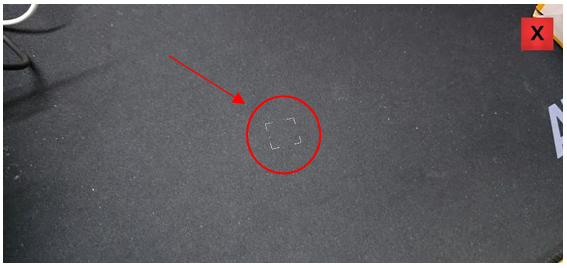
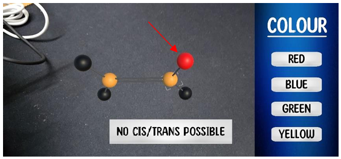
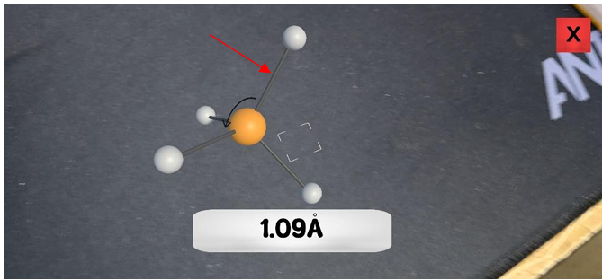

# ChemViAr
## -- APK

• Download the apk file.

• Give camera permission.

• After opening any AR page, the camera will open. Wait until you see the square on the screen. When the square appears click on the screen.

• You can drag, zoom in, zoom out and rotate the model with your fingers.

• For Cis/Trans Example click on each sphere to change its colour.

• For Geometric Parameters click on the angel or the bond to know its value.

• Check out the video from the link for a walkthrough. 

## -- Project 

• Download the Unity project. 

• Add it in your unity hub. 

• Let it install the necessary libraries. 

• You are good to go. 

## -- Extra Details 

• This project in build in unity version 2022.3.18f1. 

• Minimum Android 8 is required.
